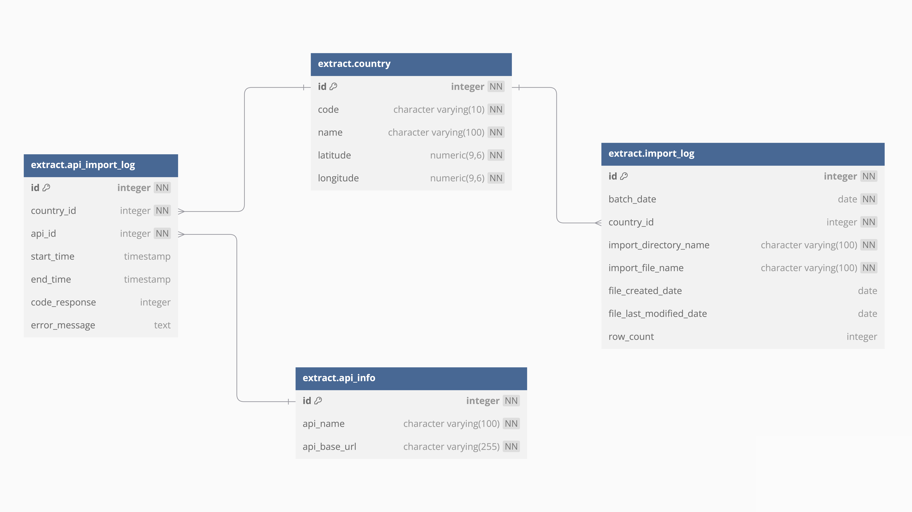
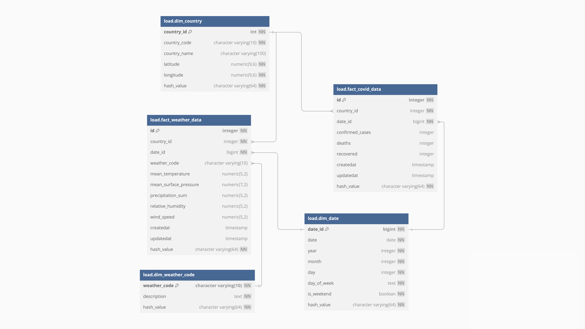
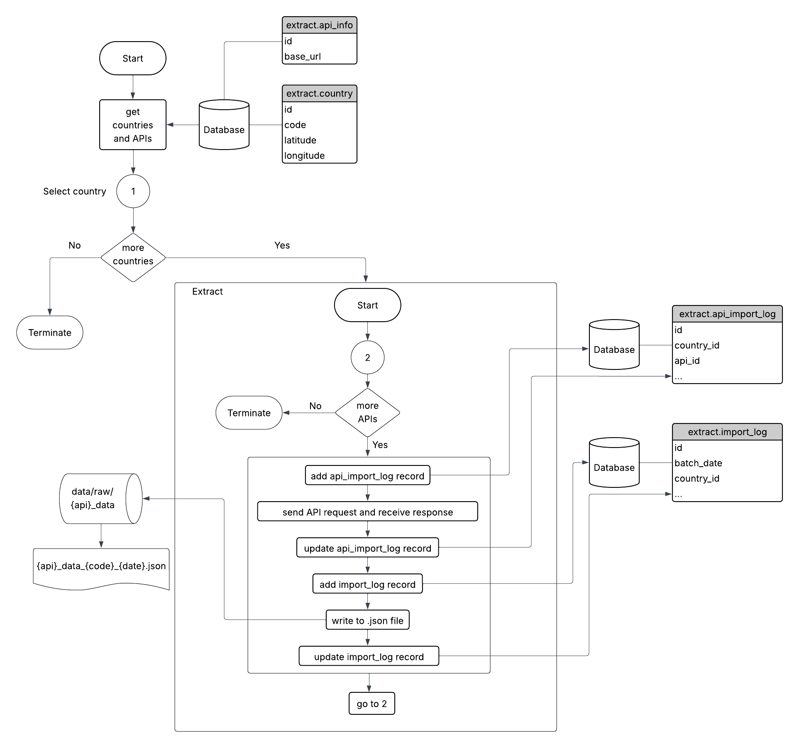

# AMDARIS 2025 Data Engineering Internship project

The project was completed as part of the 2025 Data Engineering Internship at AMDARIS, under the supervision of Mentor Marius Purici. It implements an ETL (Extract, Transform, Load) pipeline designed to store and process historical COVID-19 and Weather data for a given country and a givn date in the past. It is organized into modular components and is intended to be maintainable and scalable.

## 📖 Overview
1) 📁 [Project structure](#-project-structure)
2) ⚙️ [Tools](#tools)
3) 🌐 [API Details](#-api-details)
4) 🗃️ [Database](#database)
5) 🔄 [ETL Overview](#-etl-overview)
6) ▶️ [Running the ETL](#-running-the-etl)

## 📁 Project Structure
<pre>
📁 internship_etl/
├── 📁 common/
│   ├── database_connector.py - Super class that handles the connection to the database
│   └── utils.py - Common functions reused in other modules
├── 📁 data/ - Storage for all data files
│   ├── 📁 raw/ - Files extracted from APIs
│   │   ├── 📁 covid_data/
│   │   └── 📁 weather_data/
│   ├── 📁 processed/ - Successfully transformed files
│   │   ├── 📁 covid_data/
│   │   └── 📁 weather_data/
│   └── 📁 error/ - Files that failed during processing
│       ├── 📁 covid_data/
│       └── 📁 weather_data/
├── 📁 database/ - SQL files and DB-related scripts
│   ├── 🗃️ extract_schema.sql - Creates the extract schema and related tables
│   ├── 🗃️ transform_schema.sql - Creates the transform schema and related tables
│   └── 🗃️ load_schema.sql - Creates the load schema and related tables
├── 📁 docs/ - Resources used in the README.md file
├── 📁 extract/
│   ├── 📄 covid_api.py - API wrapper class that handles the extraction of COVID-19 data
│   ├── 📄 data_extractor.py - Inherits the DatabaseConnector class and handles additional logic
│   │                          for the interaction with data in the extract schema
│   ├── 📄 extract.py - Handles the extract routine of the ETL
│   └── 📄 weather_api.py - API wrapper class that handles the extraction of weather data
├── 📁 load/
│   ├── 📄 data_loader.py - Inherits the DatabaseConnector class and handles additional logic
│   │                       for the interaction with data in the load schema
│   └── 📄 load.py - Handles the load routine of the ETL
├── 📁 streamlit/ - Data visualization with Streamlit
│   ├── 📄 dashboard.py - Page configuration and UI
│   ├── 📄 data_page.py - Generates visual representations related to COVID-19 and Weather data
│   └── 📄 log_page.py - Generates visual representations related to import and transform logs
├── 📁 transform/
│   ├── 📄 data_transformer.py - Inherits the DatabaseConnector class and handles additional logic
│   │                            for the interaction with data in the transform schema
│   └── 📄 transform.py - Handles the transform routine of the ETL
├── 📁 weather_description/
│   └── 🧾 wmo_code_4677.csv - Provides the description for WMO 4677 codes
├── 🔒 .gitignore
├── 🗒️ README.md - Project documentation
├── 📄 etl.py - Entrypoint to run the full pipeline
└── 🗒️ requirements.txt - Python dependencies
</pre>

<h2 id="tools">⚙️ Tools</h2>
Whilst the project is built primarily on the Python Standard Library, several additional tools were used to support development, data processing, and visualization. Below is a list of the key tools used.
- [PostgreSQL](https://www.postgresql.org/) - The relational database management system of choice.
- [psycopg2](https://www.psycopg.org/) - The most popular PostgreSQL adapter for Python.
- [requests](https://requests.readthedocs.io/) - The HTTP library for Python.
- [pandas](https://pandas.pydata.org/) - Data analysis and manipulation tool.
- [Streamlit](https://streamlit.io/) - Transforms Python scripts into interactive web apps to build data dashboards.
- [Plotly](https://plotly.com/python/plotly-express/) - Graphing lirary for interactive charts.

## 🌐 API Details
This ETL pipeline extracts data from two public APIs:

### [COVID-19 Statistics API](https://covid-api.com/)
It is based on the COVID-19 Data Repository by the Center for Systems Science and Engineering (CSSE) at Johns Hopkins University. It is important to mention that on March 10, 2023, the Johns Hopkins Coronavirus Resource Center ceased its collecting and reporting of global COVID-19 data.
- **Endpoint base URL**: https://covid-api.com/api/reports/total
- Requires the **date** of the report in the format YYYY-MM-DD and a country's **ISO code**.
- For successful requests, the response has the following form:
```json
{
  "data": {
    "date": "2020-02-28",
    "last_update": "2020-02-01 11:53:00",
    "confirmed": 12,
    "confirmed_diff": 20,
    "deaths": 2,
    "deaths_diff": 3,
    "recovered": 4,
    "recovered_diff": 5,
    "active": 6,
    "active_diff": 12,
    "fatality_rate": 0.1667
  }
}
```
- If the fields are specified incorrectly, the response has the following form:
```json
{
  "title": "HTTP Unprocessable Entity",
  "code": 0,
  "message": "The given data was invalid.",
  "fields": {
    "some_field": [
      "Error description array for Some Field."
    ]
  }
}
```

### [Weather API](https://open-meteo.com/en/docs/historical-forecast-api)
This API provides access to archived high-resolution weather model data from the Weather Forecast API. The data is continuously archived and updated daily. In the context of the project, the daily weather is extracted for a given date in the past (e.g. 2022).
- **Endpoint base URL**: https://historical-forecast-api.open-meteo.com/v1/forecast
- For the daily data for a given date in the past, it requires the coordinates of the desired location (**latitude** and **longitude**), the **start date** and **end date**. By default, it expects the user to define the weather related quantities that are to be extracted (e.g. mean temperature, etc). In the context of the project, all quantities are to be extracted.
- For successful requests, a sample response has the following form:
```json
{
    "latitude": 52.52,
    "longitude": 13.419,
    "elevation": 44.812,
    "generationtime_ms": 2.2119,
    "utc_offset_seconds": 0,
    "timezone": "Europe/Berlin",
    "timezone_abbreviation": "GMT+2",
    "daily_units": {
        "time": "iso8601",
        "weather_code": "wmo code",
        "temperature_2m_mean": "\u00b0C"
    },
    "daily": {
        "time": [
            "2022-07-01"
        ],
        "weather_code": [
            1
        ],
        "temperature_2m_mean": [
            13
        ]
    }
}
```
- In case an error occurs, for example a URL parameter is not correctly specified, a JSON error object is returned with a HTTP 400 status code:
```json
{
    "error": true,
    "reason": "Cannot initialize WeatherVariable from invalid String value tempeture_2m for key daily"
}
```

<h2 id="database">🗃️ Database</h2>
The following Entity Relationship Digrams (ERDs) provide a high-level overview of the database structure used in this project. It illustrates the relationships between logs, unprocessed and processed data tables that support the ETL pipeline. There are three schemas, each connected to the corresponding process in the ETL pipeline.

### Extract Schema
<<<<<<< HEAD

=======

>>>>>>> 11a3adb802bff92468ad56b943ae6aefff17120b
- The **country** table stores the code, latitude and longitude for each country. The records are used as parameters for API data extraction.
- The **api_info** table stores the name and base URL of the two APIs.
- The **api_import_log** table tracks each API call for each country and stores the API extraction time and whether the call was successful.
- The **import_log** table tracks each saved file with the raw data extracted from the API. Each file is linked to a particular country via the country's id.

### Transform Schema
<<<<<<< HEAD

=======

>>>>>>> 11a3adb802bff92468ad56b943ae6aefff17120b
- The **transform_log** table tracks each transformation attempt for a raw file and documents whether the attempt was successful or not.
- The **transform_covid_data_import** and **transform_weather_data_import** tables store the processed data taken from the newly successfully processed files. They link to the **extract.country** table to provide external validation that the processed data belongs a country present in the extract schema.

### Load Schema
<<<<<<< HEAD

=======

>>>>>>> 11a3adb802bff92468ad56b943ae6aefff17120b
- The load schema was designed as a STAR schema, which splits tables into dimension and fact tables. Each table contains a hash_value column which is used in the load process of the ETL to determine whether the tables need to be updated.
- The **dim_country** is a dimension table and follows a similar structure to the **extract.country** table.
- The **dim_date** is a dimension table and has several descriptive column that can be convenient to use in data visualization.
- The **dim_weather_code** is a dimension table that matches a weather code to a predifined description.
- The **fact_weather_data** and **fact_covid_data** tables are both fact tables and each reference to the dimension tables via foreign keys. The additionally contain information about the date the records were created and updated. It is important to note that **dim_weather_code** is only referenced in the **fact_weather_data**.

 ## 🔄 ETL Overview
For each modular step, there is an accompanying flow chart, that lists the steps in sequential order.
### Extract
 

### Transform


### Load


<<<<<<< HEAD
## ▶️ Running the ETL
=======
## ▶️ Running the ETL

>>>>>>> 11a3adb802bff92468ad56b943ae6aefff17120b
